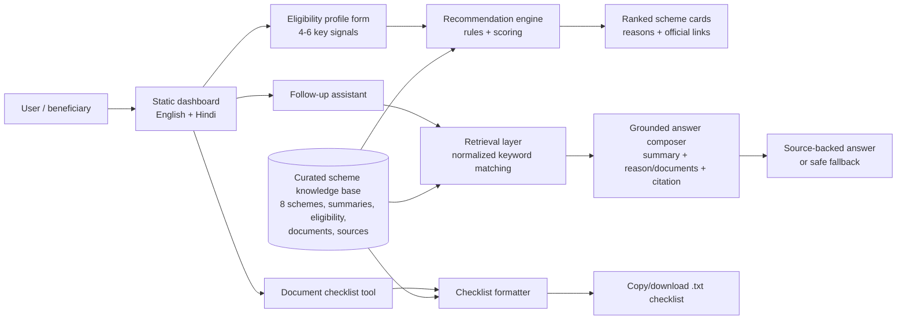
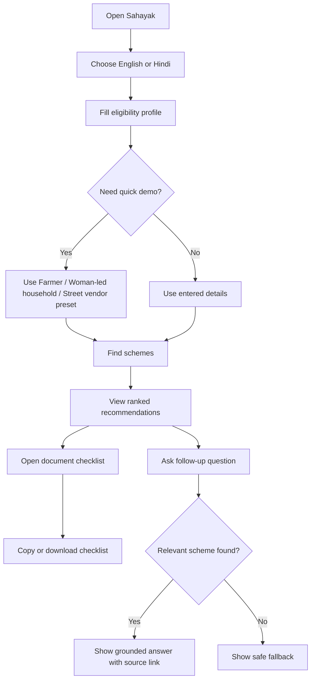
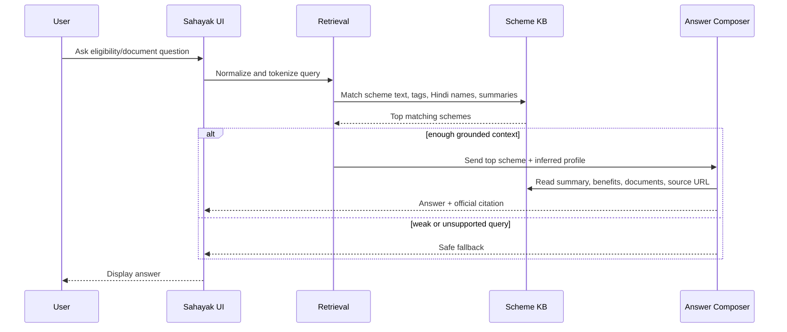
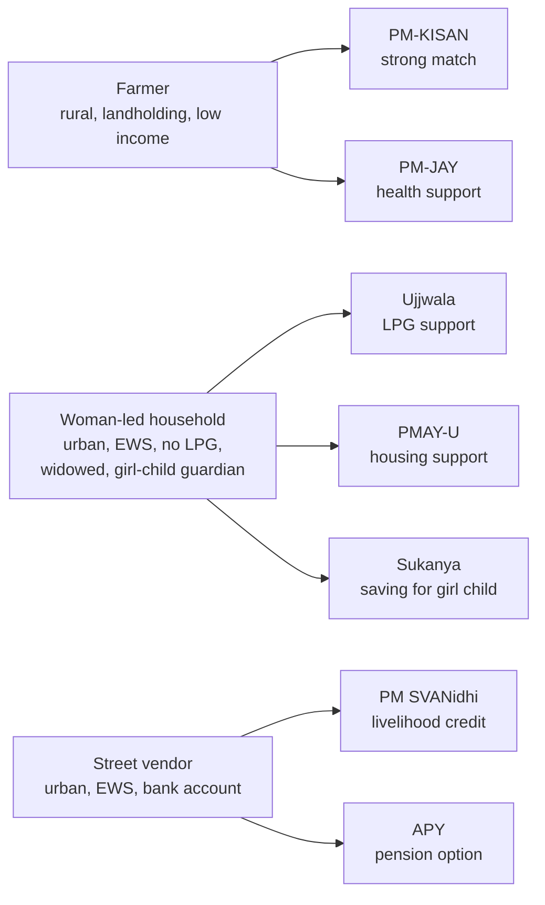

# Sahayak

**Sahayak** is a low-bandwidth welfare scheme discovery assistant built for **NSS Open Projects 2026 - Track 1.1: AI-Based Multilingual Chatbot for Welfare Scheme Awareness**.

The prototype helps a user fill a short eligibility profile, discover relevant welfare schemes, ask grounded follow-up questions, and generate a document checklist in English or Hindi.

Live demo: `https://parzival1821.github.io/Multilingual_Chatbot/`

## Project Snapshot

- **Status:** Functional MVP deployed on GitHub Pages.
- **Scope:** 8 high-impact central welfare schemes.
- **Languages:** English and Hindi, with Hindi rendered in Devanagari.
- **Core AI pattern:** Retrieval-grounded answer generation over a curated scheme knowledge base.
- **User flow:** 4-6 simple eligibility signals produce a personalized scheme shortlist.
- **Safety:** Unknown questions return a fallback instead of hallucinated scheme details.
- **Verification:** Local core and static smoke tests pass with `npm run check`.

## NSS Challenge Fit

| Official expectation | Current implementation |
| --- | --- |
| Focused catalogue of 8-10 schemes | 8 schemes included |
| Eligibility-questioning flow | Guided profile form with area, occupation, gender, income, land, housing, LPG, bank, and special category signals |
| Personalized shortlist | Ranked recommendations with match reasons |
| Multilingual interface | English + Hindi Devanagari |
| Document checklist | Copyable and downloadable scheme-specific checklist |
| Grounded answers | Retrieval over local scheme data with source links |
| Low-bandwidth thinking | Static app, text-first UI, no heavy framework, downloadable `.txt` handoff |
| Honest unknown handling | Safe fallback for unsupported questions |

## Scheme Catalogue

| Scheme | Primary beneficiary | Current verification status |
| --- | --- | --- |
| PM-KISAN Samman Nidhi | Landholding farmer families | Verified official source |
| Ayushman Bharat PM-JAY | Poor and vulnerable families needing health cover | Verified official source |
| Pradhan Mantri Ujjwala Yojana | Adult women from poor households without LPG | Verified official source |
| Pradhan Mantri Awas Yojana - Urban 2.0 | Urban EWS/LIG/MIG families without a permanent house | Verified official source |
| National Social Assistance Programme | BPL elderly, widows, disabled persons, and vulnerable households | Verified official source |
| PM Street Vendor's AtmaNirbhar Nidhi | Urban and peri-urban street vendors | Official source, recheck latest rules |
| Atal Pension Yojana | Informal/unorganised workers with bank accounts | Official source, recheck latest rules |
| Sukanya Samriddhi Account | Girl child, through parent or guardian | Official source, recheck latest rules |

## System Architecture



## User Journey



## Grounded Answer Flow



## Demo Personas



## Implementation Details

- `index.html` and `styles.css` implement the responsive single-page dashboard.
- `src/data.js` stores curated scheme data, Hindi names, summaries, labels, documents, benefits, and source links.
- `src/core.js` contains eligibility scoring, retrieval, profile inference, checklist formatting, and grounded answer composition.
- `src/app.js` connects the UI to the recommendation engine, assistant, language switcher, and checklist actions.
- `tests/core.test.js` validates recommendation ranking, retrieval, fallback behavior, Hindi queries, and checklist logic.
- `tests/static-smoke.test.js` validates the static shell, deployed asset references, Hindi Devanagari copy, and Pages workflow shape.

## Run Locally

```bash
npm run dev
```

Then open:

```text
http://localhost:4173
```

## Test

```bash
npm test
```

Run all local checks:

```bash
npm run check
```

## Demo Script

1. Open the live app or run it locally.
2. Click the `Farmer` preset.
3. Show PM-KISAN as a strong match and PM-JAY as an additional support option.
4. Click `View documents` on PM-KISAN and show the checklist panel.
5. Copy or download the checklist to demonstrate low-bandwidth handoff.
6. Ask: `What documents do I need for Ayushman Bharat?`
7. Switch to Hindi and ask: `मुझे घर के लिए कौन सी योजना मिल सकती है?`
8. Show source links, verification labels, and the safe fallback for unsupported questions.

## Verification Checklist

- Farmer persona ranks PM-KISAN first.
- Woman-led household persona shows Ujjwala, PMAY-U, and Sukanya.
- Street vendor persona ranks PM SVANidhi first.
- Hindi mode uses Devanagari labels, prompts, scheme names, and checklist content.
- Recommendation `View documents` action scrolls to and highlights the checklist panel.
- Checklist copy and download actions produce a scheme-specific document list.
- Unsupported questions produce a safe fallback instead of invented scheme details.
- `npm run check` passes.
- `details.md`, `plan.md`, and `schemes.md` remain local-only and uncommitted.

## Project Positioning

Sahayak is intentionally built as a practical AI product rather than a custom ML research model. Its strength is the combination of structured eligibility logic, retrieval-grounded answers, bilingual UX, source-backed recommendations, and a low-bandwidth document handoff that can later be extended to WhatsApp, SMS, or IVR.
