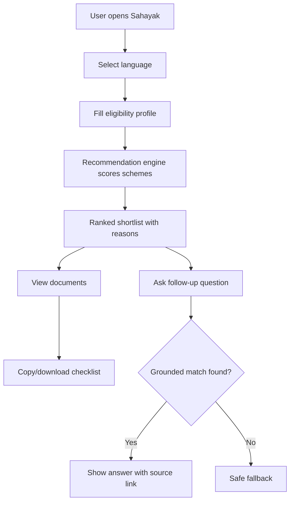
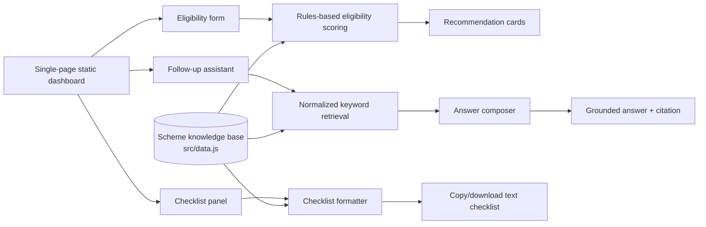

# Solution Framework

Project: **Sahayak - Welfare Scheme Discovery Assistant**  
Challenge: **AI-Based Multilingual Chatbot for Welfare Scheme Awareness**

## Solution Overview

Sahayak is a static, low-bandwidth web assistant that combines structured eligibility scoring with retrieval-grounded follow-up answers. The system does not attempt to cover every welfare scheme. Instead, it focuses on a curated catalogue of 8 high-impact schemes and demonstrates a trustworthy product loop:

1. Collect simple profile signals.
2. Rank relevant schemes.
3. Explain why each scheme matches.
4. Answer follow-up questions using scheme-grounded retrieval.
5. Generate a document checklist for application preparation.

## Product Flow

## Technical Architecture

## Tech Stack

| Layer | Implementation |
| --- | --- |
| Frontend | HTML, CSS, vanilla JavaScript |
| Data | Curated local JSON-like objects in `src/data.js` |
| Recommendation engine | Rules-based scoring in `src/core.js` |
| Retrieval | Keyword/token matching over scheme names, tags, summaries, Hindi names, documents, and search text |
| Language support | English + Hindi Devanagari copy maps |
| Deployment | GitHub Pages |
| Testing | Node-based core and static smoke tests |

## Knowledge Base

The MVP includes 8 schemes:

- PM-KISAN Samman Nidhi.
- Ayushman Bharat PM-JAY.
- Pradhan Mantri Ujjwala Yojana.
- Pradhan Mantri Awas Yojana - Urban 2.0.
- National Social Assistance Programme.
- PM Street Vendor's AtmaNirbhar Nidhi.
- Atal Pension Yojana.
- Sukanya Samriddhi Account.

Each scheme entry stores:

- English name.
- Hindi display name.
- English and Hindi summaries.
- Target beneficiary.
- Benefits.
- Eligibility signals.
- Documents.
- Application paths.
- Official source URLs.
- Tags and search text.
- Verification status.

## Recommendation Logic

The recommendation engine converts a user profile into a ranked shortlist. It evaluates signals such as:

- Rural vs urban area.
- Occupation.
- Gender.
- Age group.
- Income category.
- Cultivable land.
- Permanent house ownership.
- LPG connection.
- Bank account.
- Special categories such as widow, disability, and girl-child guardian.

Each scheme has simple scoring rules. For example:

- PM-KISAN gains score for farmer occupation, cultivable land, and rural area.
- Ujjwala gains score for adult woman, no LPG connection, and low income.
- PMAY-U gains score for urban household, no permanent house, and EWS/LIG/MIG/BPL income category.
- NSAP gains score for BPL status, senior citizen, widowhood, or disability.

## Retrieval-Grounded Answering

The assistant uses retrieval instead of free-form hallucination:

1. Normalize the user's question.
2. Tokenize English and Devanagari text while preserving Hindi matras.
3. Match against scheme name, Hindi name, summary, documents, tags, and search text.
4. Check whether the match has enough context.
5. Compose an answer using only stored scheme data.
6. Attach an official source link.
7. Return a safe fallback if the match is weak.

## Safety and Trust

Sahayak avoids unsupported claims through:

- Official source links on recommendation cards.
- Source links inside assistant answers.
- Verification labels for each scheme entry.
- Explicit recheck labels for schemes where latest rules should be verified.
- Safe fallback for unsupported questions.
- Tests for fallback behavior and high-risk query routing.

## Multilingual Design

The MVP supports:

- English interface.
- Hindi interface in Devanagari.
- Hindi scheme display names.
- Hindi summaries, reasons, document names, benefits, and prompts.
- Devanagari query handling for examples such as:
  - `आयुष्मान के लिए कौन से दस्तावेज चाहिए?`
  - `क्या मैं पीएम-किसान के लिए पात्र हूं?`
  - `मैं 55 वर्ष की विधवा हूं, मेरे लिए कौन सी योजना बेहतर है?`

## Low-Bandwidth Design Choices

- Static website with no frontend framework.
- Text-first UI.
- No heavy media dependencies.
- Copyable and downloadable `.txt` checklists.
- Works as a single-page app hosted on GitHub Pages.
- Compatible with WhatsApp/SMS/IVR channels because the logic is text-based.

## Scale Readiness

| Area | Readiness |
| --- | --- |
| Web deployment | Static GitHub Pages prototype with 8 schemes |
| Language expansion | Copy maps and data fields support additional languages |
| Scheme expansion | Data model separates scheme content from UI logic |
| Messaging channels | Text-first engine can be connected to WhatsApp/SMS gateways |
| Field operations | Checklist output supports volunteers during outreach camps |

## Risks and Mitigations

| Risk | Mitigation |
| --- | --- |
| Outdated scheme rules | Verification labels and official source links |
| Hallucinated answers | Retrieval-grounded composition and fallback |
| Low literacy | Short questions, simple summaries, Hindi labels |
| Poor connectivity | Static low-bandwidth web app and text checklist |
| Excessive scheme scope | Focused 8-scheme catalogue |
| Language gaps | Copy maps and searchable Hindi display names |

## Financial and Operational Model

For MVP deployment:

- Hosting cost: free through GitHub Pages.
- Data storage: local static files.
- Maintenance: periodic scheme updates from official portals.
- Field deployment: NSS volunteers or NGO field workers can use it during awareness drives.

For WhatsApp/SMS deployment:

- Twilio/WhatsApp Business API costs depend on message volume.
- A district or NGO deployment can start with a small curated scheme catalogue and expand.
- The assistant can be maintained by a small technical volunteer team.

## Conclusion

Sahayak is feasible because it avoids unnecessary complexity. It demonstrates the core AI product value: grounded personalization, multilingual access, and actionable document preparation. Its architecture is simple enough for a student team to build and maintain, while still extensible toward real last-mile channels.
