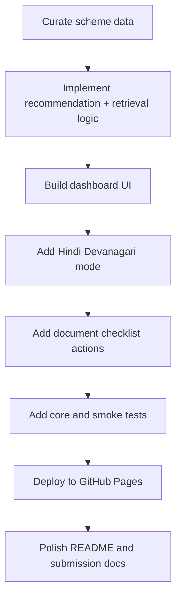

# Prototype and Implementation Plan

Project: **Sahayak - Welfare Scheme Discovery Assistant**  
Live demo: `https://parzival1821.github.io/Multilingual_Chatbot/`  
Repository: `https://github.com/parzival1821/Multilingual_Chatbot`

## Prototype Status

The current prototype is a deployed static web app. It demonstrates the end-to-end user journey required for the NSS Challenge 1.1 MVP:

1. Select English or Hindi.
2. Fill an eligibility profile.
3. View personalized welfare scheme recommendations.
4. Ask grounded follow-up questions.
5. Generate, copy, and download a document checklist.

## MVP Feature Map

| Feature | Status | Notes |
| --- | --- | --- |
| Live prototype | Complete | GitHub Pages deployment |
| 8-scheme catalogue | Complete | Central schemes with official source links |
| Eligibility questionnaire | Complete | Uses household and occupation signals |
| Personalized recommendations | Complete | Ranked cards with reasons |
| Hindi interface | Complete | Devanagari UI, prompts, scheme names, summaries |
| Follow-up assistant | Complete | Retrieval-grounded answer generation |
| Safe fallback | Complete | Prevents unsupported answers |
| Document checklist | Complete | Copy/download text checklist |
| Demo personas | Complete | Farmer, woman-led household, street vendor |
| Automated tests | Complete | Core and static smoke checks |

## Repository Structure

```text
.
├── index.html
├── styles.css
├── package.json
├── README.md
├── src
│   ├── app.js
│   ├── core.js
│   └── data.js
├── tests
│   ├── core.test.js
│   └── static-smoke.test.js
└── submission
    ├── 01-problem-analysis-report.md
    ├── 02-solution-framework.md
    ├── 03-prototype-implementation-plan.md
    ├── 04-impact-projection.md
    ├── 05-pilot-test-report-template.md
    ├── 06-final-presentation-outline.md
    └── 07-submission-portal-details.md
```

## Key Files

| File | Responsibility |
| --- | --- |
| `index.html` | Dashboard structure |
| `styles.css` | Responsive visual design |
| `src/data.js` | Scheme knowledge base and language labels |
| `src/core.js` | Recommendation, retrieval, profile inference, checklist formatting |
| `src/app.js` | UI event handling and rendering |
| `tests/core.test.js` | Behavioral tests for recommendations, assistant, checklist |
| `tests/static-smoke.test.js` | Static app and deployment checks |

## Implementation Flow



## Local Run Instructions

```bash
npm run dev
```

Then open:

```text
http://localhost:4173
```

## Test Instructions

Run core tests:

```bash
npm test
```

Run all checks:

```bash
npm run check
```

Expected result:

```text
All core tests passed.
Static smoke checks passed.
```

## Deployment

The project is deployed using GitHub Pages from the `main` branch.

Deployment workflow:

1. Push changes to `main`.
2. GitHub Actions builds the static site.
3. Pages serves the app at the live demo URL.

## Demo Script

1. Open the live app.
2. Use English mode first.
3. Click the `Farmer` preset.
4. Show PM-KISAN as a strong match.
5. Click `View documents`.
6. Copy/download the checklist.
7. Ask: `What documents do I need for Ayushman Bharat?`
8. Switch to Hindi.
9. Ask: `मुझे घर के लिए कौन सी योजना मिल सकती है?`
10. Show Hindi recommendations, source links, and fallback behavior.

## Prototype Validation

Automated checks currently cover:

- PM-KISAN ranking for farmer profile.
- PM-JAY retrieval for Ayushman document questions.
- Hindi Devanagari retrieval.
- Widow follow-up routing to NSAP.
- PM SVANidhi ranking for street vendor profile.
- Checklist generation and formatting.
- Safe fallback for unsupported queries.
- Static asset references.
- GitHub Pages workflow shape.

## Implementation Roadmap

### Immediate Submission Version

- Keep the current 8-scheme web MVP.
- Use README diagrams for architecture and user flow.
- Submit GitHub repo and live demo link.
- Add pilot observations if time permits.

### Next Version

- Add one more regional language beyond Hindi.
- Add WhatsApp/SMS interface through Twilio or WhatsApp Business API.
- Add admin tool for updating scheme data.
- Expand scheme coverage using official scheme catalogues.
- Add analytics for NGO/NSS outreach camps.

## Conclusion

The current prototype is ready as a functional MVP. It demonstrates the core end-to-end solution loop and is simple enough to deploy, test, and explain during evaluation.

