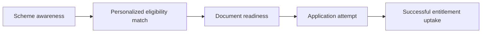

# Impact Projection

Project: **Sahayak - Welfare Scheme Discovery Assistant**

## Objective

This document estimates the potential social impact of Sahayak if used by NSS volunteers, NGOs, or local field workers during welfare awareness drives. The projection is conservative and intended to show the order of magnitude of possible benefit, not claim measured deployment impact.

## Impact Logic

Sahayak improves outcomes by reducing friction in four steps:

1. Awareness: user discovers relevant schemes.
2. Comprehension: user understands why the scheme may apply.
3. Preparation: user receives a document checklist.
4. Action: user is more likely to apply through official channels.



## Base Assumptions

| Variable | Conservative assumption |
| --- | --- |
| Outreach population in pilot district/NGO program | 10,000 people |
| Share likely eligible for at least one listed scheme | 40% |
| Eligible people in target population | 4,000 |
| Current awareness/completion gap | Significant, based on official challenge framing |
| Additional users who attempt application due to Sahayak | 10-20% of eligible users |
| Successful completion among additional attempts | 40-60% |

## Scenario Model

### Conservative Scenario

- Eligible users: 4,000.
- Additional application attempts due to Sahayak: 10% = 400.
- Successful completion rate among additional attempts: 40%.
- Additional successful enrollments/applications: 160.

### Moderate Scenario

- Eligible users: 4,000.
- Additional application attempts due to Sahayak: 15% = 600.
- Successful completion rate among additional attempts: 50%.
- Additional successful enrollments/applications: 300.

### High Scenario

- Eligible users: 4,000.
- Additional application attempts due to Sahayak: 20% = 800.
- Successful completion rate among additional attempts: 60%.
- Additional successful enrollments/applications: 480.

## Entitlement Value Illustration

The value differs by scheme. The table below uses illustrative benefits from the current catalogue and should be verified scheme-by-scheme before field reporting.

| Scheme | Benefit type | Example value mechanism |
| --- | --- | --- |
| PM-KISAN | Direct income support | Rs. 6,000 per year for eligible farmer families |
| PM-JAY | Health protection | Up to Rs. 5 lakh annual family health cover |
| Ujjwala | Clean cooking fuel support | Deposit-free LPG connection and related support |
| PMAY-U | Housing support | Housing construction/purchase/rental assistance |
| NSAP | Social assistance | Pension or family benefit support |
| PM SVANidhi | Livelihood credit | Working capital loan and incentives |
| APY | Pension | Guaranteed pension after age 60 based on contributions |
| Sukanya | Savings | Government-backed girl-child savings account |

## PM-KISAN Example Calculation

If only 50 of the additional successful applications are PM-KISAN enrollments:

```text
50 households x Rs. 6,000 per year = Rs. 3,00,000 per year
```

If 200 households are helped over a larger outreach cycle:

```text
200 households x Rs. 6,000 per year = Rs. 12,00,000 per year
```

This calculation covers only one scheme. Health coverage, housing support, pension support, and livelihood credit can create additional financial protection beyond direct cash transfer.

## Time and Process Savings

Sahayak can also reduce non-cash friction:

| Friction point | Expected improvement |
| --- | --- |
| Finding relevant schemes | One guided profile instead of manual searching |
| Understanding eligibility | Short reason bullets per recommendation |
| Preparing documents | Copyable/downloadable checklist |
| Avoiding wrong applications | Better profile-to-scheme matching |
| Field-worker triage | Faster beneficiary screening during camps |

If a field worker saves even 10 minutes per beneficiary screened, then:

```text
1,000 screened users x 10 minutes = 10,000 minutes saved
10,000 minutes = 166.7 hours saved
```

## Cost Projection

### MVP Cost

| Cost head | Estimate |
| --- | --- |
| Hosting | Free on GitHub Pages |
| Frontend framework | None |
| Data storage | Static files |
| Maintenance | Volunteer/developer time |
| Field usage | Any phone/browser |

### WhatsApp/SMS Cost Consideration

Costs would depend on message volume and provider pricing. The current architecture keeps the core logic text-based, so the same recommendation and retrieval engine is compatible with a WhatsApp/SMS backend.

## Sustainability Pathway

1. NSS volunteers use the tool during awareness camps.
2. Local NGOs validate scheme coverage and language clarity.
3. Additional schemes/languages are added based on local need.
4. District-level or NGO-level deployment integrates WhatsApp/SMS.
5. Field feedback updates scheme data and document requirements.

## Impact Metrics to Track in Pilot

| Metric | Why it matters |
| --- | --- |
| Flow completion rate | Measures usability |
| Comprehension score | Measures whether users understood scheme summaries |
| Checklist usefulness rating | Measures actionability |
| Application intent | Measures likely next step |
| Actual application attempt | Measures conversion |
| Successful enrollment | Measures final welfare uptake |

## Conclusion

Sahayak's impact comes from increasing successful navigation of existing welfare schemes. Even modest improvements in awareness and document readiness can translate into meaningful entitlement access, especially when the tool is used by NSS volunteers or NGOs across repeated community outreach sessions.
