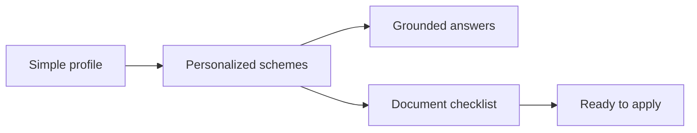

# Final Presentation Outline

Project: **Sahayak - Welfare Scheme Discovery Assistant**  
Recommended length: **6-8 slides**

## Slide 1: Title

**Sahayak: Multilingual Welfare Scheme Discovery Assistant**

Subtitle:

Low-bandwidth, source-backed scheme awareness for rural and low-income beneficiaries.

Include:

- Team/member names.
- NSS Open Projects 2026.
- Track 1.1: AI-Based Multilingual Chatbot for Welfare Scheme Awareness.
- Live demo link and QR code if possible.

Speaker note:

Sahayak helps users discover welfare schemes, understand eligibility, and prepare documents in English or Hindi.

## Slide 2: Problem

Main message:

India has many welfare schemes, but eligible users often do not discover or complete applications.

Use 3 pain points:

- Information is fragmented across portals and PDFs.
- Eligibility language is hard to understand.
- Documentation friction stops users from applying.

Speaker note:

The problem is not lack of welfare design; it is last-mile access, language, trust, and actionability.

## Slide 3: Target Users

Show 3 personas:

1. Farmer.
2. Woman-led household.
3. Street vendor / informal worker.

For each:

- Need.
- Relevant schemes.
- Product value.

Speaker note:

The product is designed around common beneficiary contexts rather than scheme names.

## Slide 4: Solution

Show the user journey:



Key points:

- 4-6 simple eligibility signals.
- Ranked recommendations.
- Source-backed follow-up answers.
- Copy/download checklist.

Speaker note:

Sahayak turns eligibility confusion into a short decision flow.

## Slide 5: Product Demo

Demo flow:

1. Choose Farmer preset.
2. Show PM-KISAN recommendation.
3. Click View documents.
4. Ask Ayushman document question.
5. Switch to Hindi and ask a housing question.
6. Show fallback for unsupported question.

Speaker note:

Highlight trust markers: official source links, verification labels, and safe fallback.

## Slide 6: Technical Architecture

Show:

- Static dashboard.
- Scheme knowledge base.
- Recommendation engine.
- Retrieval layer.
- Answer composer.
- Checklist formatter.

Speaker note:

The MVP uses retrieval-grounded generation rather than an unconstrained chatbot, reducing hallucination risk.

## Slide 7: Impact Projection

Use conservative model:

- 10,000 outreach population.
- 4,000 likely eligible for at least one scheme.
- 10-20% additional application attempts.
- 160-480 additional successful applications depending on scenario.

Example:

```text
50 additional PM-KISAN enrollments x Rs. 6,000/year = Rs. 3,00,000/year
```

Speaker note:

Even small improvements in welfare uptake can translate into meaningful entitlement access.

## Slide 8: Roadmap and Ask

Roadmap:

- Add more regional languages.
- Add WhatsApp/SMS/IVR interface.
- Expand scheme catalogue.
- Pilot with NSS/NGO field workers.
- Build update workflow for official scheme changes.

Ask:

- Mentor feedback.
- Pilot access through NSS/NGO community.
- Support for WhatsApp/SMS deployment.

Speaker note:

The prototype is ready for validation and extension into real last-mile channels.

## Backup Slide: Evaluation Fit

| Rubric area | Sahayak response |
| --- | --- |
| Problem understanding | Targets awareness, language, documentation, and trust gaps |
| Innovation | Grounded welfare assistant with checklist handoff |
| Feasibility | Static low-cost MVP deployed on GitHub Pages |
| Impact potential | Quantified entitlement and time-saving model |
| Communication | Live demo, diagrams, and source-backed documentation |

