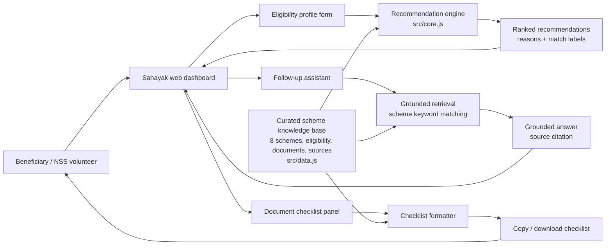
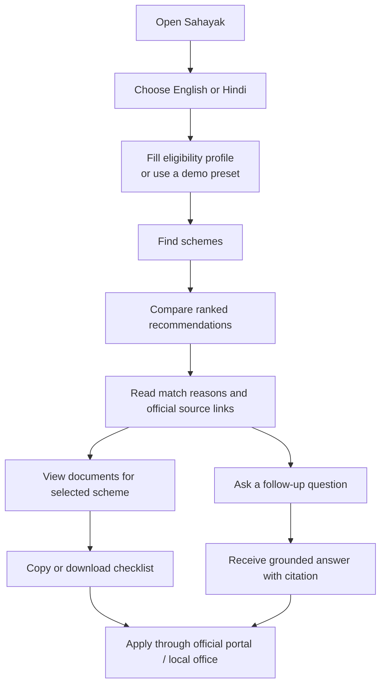
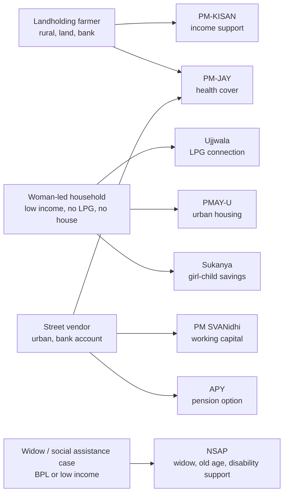
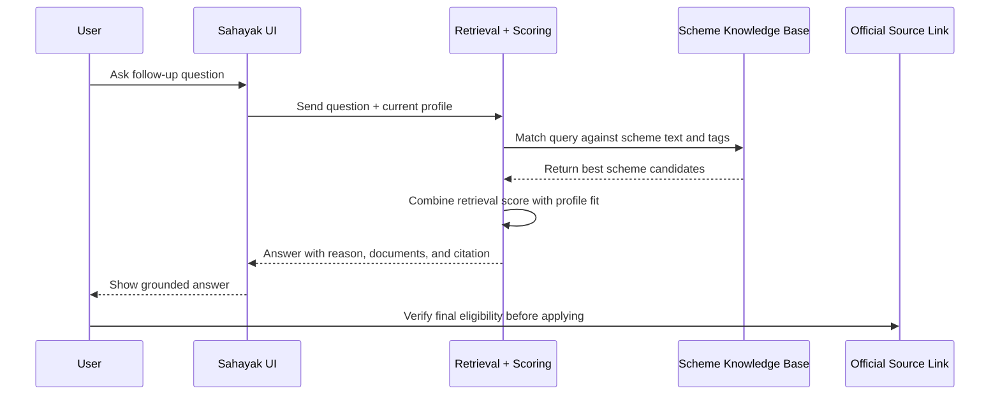
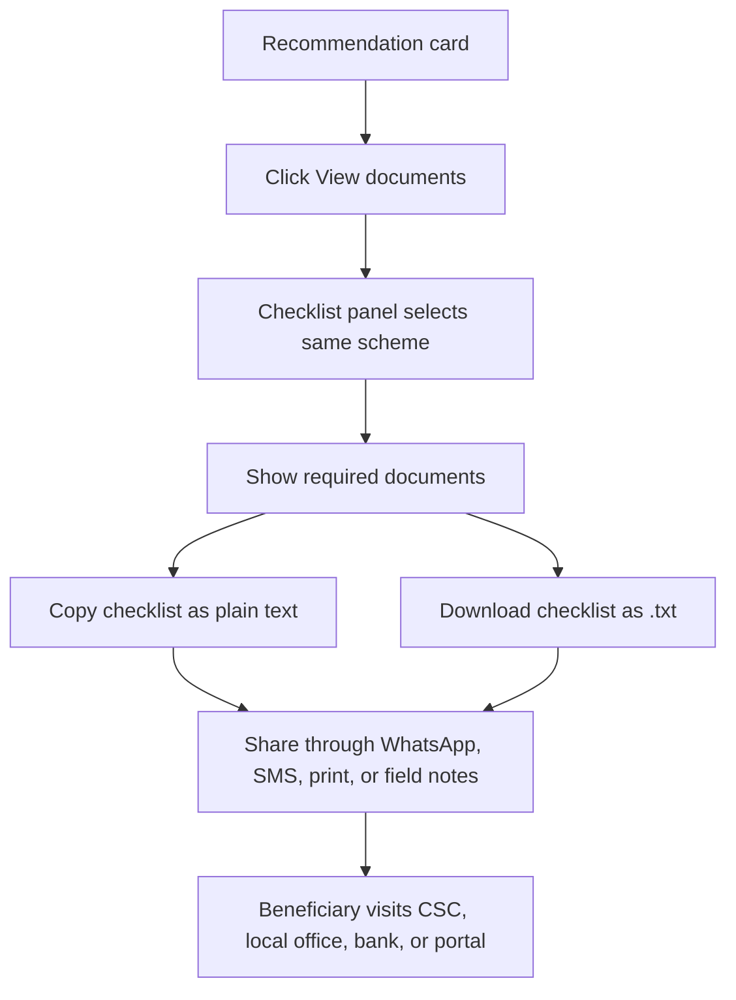
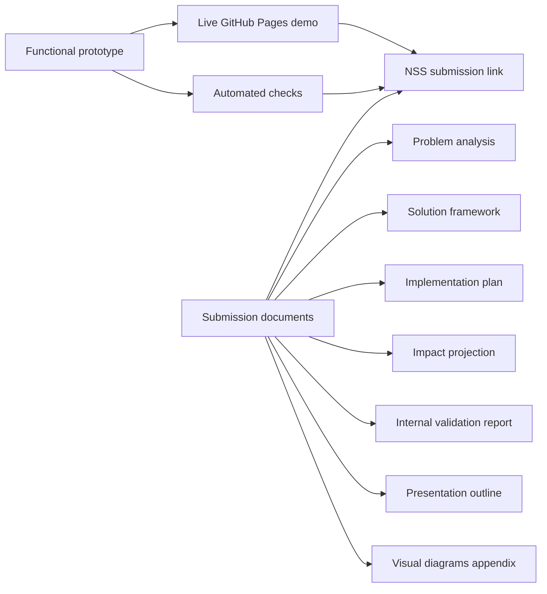

# Visual Diagrams Appendix

Project: **Sahayak - Welfare Scheme Discovery Assistant**

This appendix contains diagram-ready visuals for the README, report, and final presentation. The diagrams are written in Mermaid so they render on GitHub and can be recreated in Google Docs or slides if needed.

## System Architecture

## Beneficiary Journey

## Persona-To-Scheme Coverage

## Grounded Answer Flow

## Low-Bandwidth Handoff Flow

## Submission Deliverable Map

